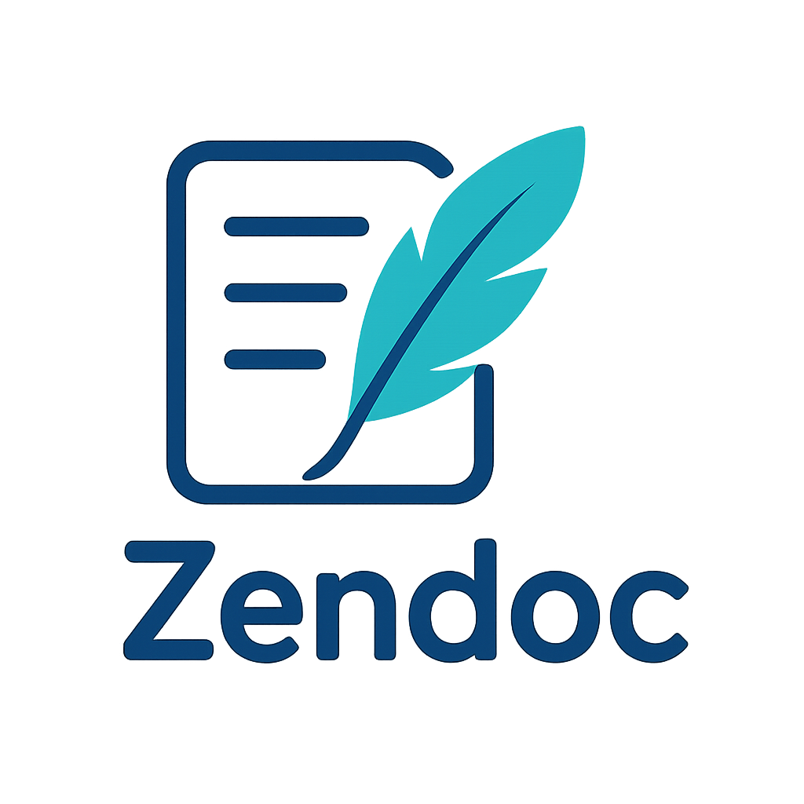

# Zendoc


[](https://codecov.io/gh/ZenDocLabs/zendoc)
[](https://sonarcloud.io/summary/new_code?id=dterbah_go-logic)
[](https://sonarcloud.io/summary/new_code?id=dterbah_go-logic)
[](https://sonarcloud.io/summary/new_code?id=dterbah_go-logic)
[](https://sonarcloud.io/summary/new_code?id=dterbah_go-logic)
[](https://sonarcloud.io/summary/new_code?id=dterbah_go-logic)

Zendoc is a powerful documentation generator specifically designed for Golang projects. It uses a familiar documentation format (similar to Javadoc) that enables developers to export comprehensive documentation in multiple formats including JSON and interactive web applications.



## Overview

Zendoc simplifies the process of creating, maintaining, and sharing documentation for your Go codebase. By parsing specially formatted comments in your code, Zendoc automatically generates structured documentation that remains in sync with your project.

[Here](https://zendoc.netlify.app/) is an example of the generated web-app for this project.

## Key Features

- **Go-Specific Documentation**: Tailored specifically for Golang projects
- **Multiple Export Formats**: Generate documentation in JSON or as a fully functional web application
- **Version Control**: Easily maintain multiple versions of your documentation
- **Customizable**: Configure what gets included in your documentation (private functions, tests, etc.)
- **Easy Integration**: Simple setup process that integrates with your existing Go projects

## Getting Started

This guide will help you install and use Zendoc effectively. Follow the links below to get started with your documentation journey!

1. [Setup Guide](./documentation/setup.md) - Install and configure Zendoc
2. [CLI Reference](./documentation/cli.md) - Learn about available commands and options
3. [Tags documentation](./documentation/tag.md) - Learn how to document your code

## Documentation Format

Zendoc uses a familiar comment-based documentation format that's easy to adopt. Here's a simple example:

```go
/**
 * @description Calculates the sum of two integers
 * @param a The first integer
 * @param b The second integer
 * @return The sum of a and b
 */
func Add(a, b int) int {
    return a + b
}
```

## Community

Join our community to share your feedback, report issues, or contribute to the project:

- [GitHub Repository](https://github.com/ZenDocLabs/zendoc)
- [Issue Tracker](https://github.com/ZenDocLabs/zendoc/issues)

---

Happy documenting!
